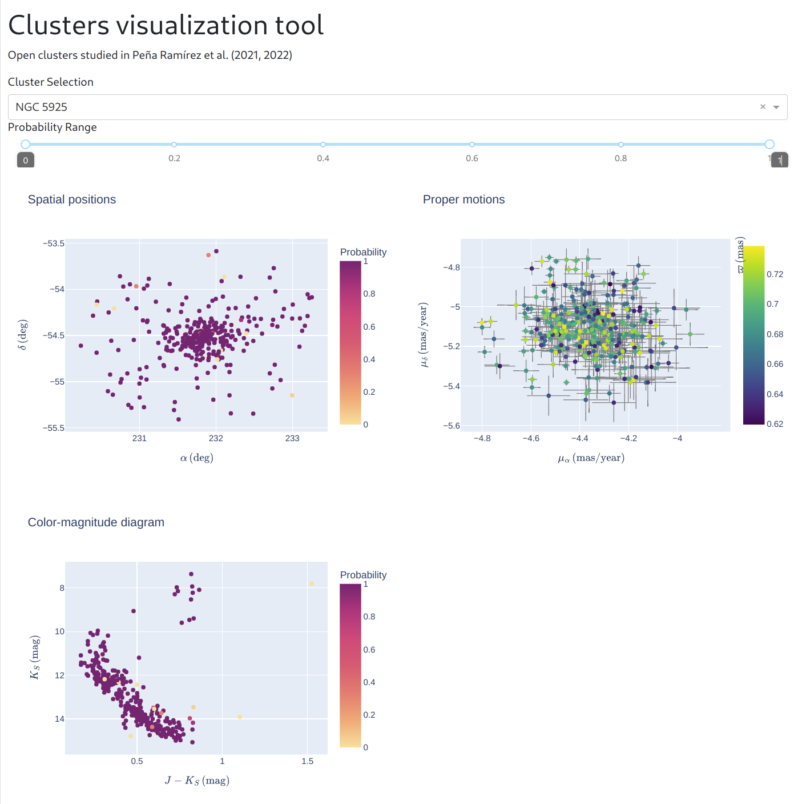

# clusters-dashboard
Interactive visualization of star clusters



## How to run the app

1. `pip install -r requirements.txt` 
2. `python main.py` 
3. Go to http://0.0.0.0:8050/ from your web browser.

## How to build and run the app using docker

```docker build -t clusterdashboard .```  

```docker run -d -p 8050:8050 clusterdashboard```